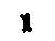
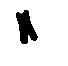

# Create a training dataset

Raw images. Starting with a microscopic image:
1. Transform the image into a black and white image. The most common tools are Photoshop, Gimp or a script wrote by you.
2. Cut bacteria from the black and white image and save into single files (jpg or PNG). This process can be manual or automatized.
3. Place the cut black and white images into two folders longitudinal_division and other_division.
4. Repeat the previous steps with the rest of the microscopic images.

**NOTE:** The current model is trained as binary classfier if you want to add more clases, add the folders you need then you must change the code from binary to multiclass classifier. to change a multiclass modify the following line in the notebook from: 
`model_ft.fc = nn.Linear(num_ftrs, 2)`  
to 
`model_ft.fc = nn.Linear(num_ftrs, number_of_classes)`  

## Dataset spliting:
1. The common way of spliting is 20% of the images are for testing, then 80% and 20% for traninig and validation with the remaining images.
2. Create a folder that will contain the three following folders: train, val and test
3. Inside of each folder (train, val and test) create two folders: longitudinal_division and other_division
4. Inside of longitudinal_division folder place the black and white bacteria images (jpg or png) with logitudinal division. 
 
5. Inside of other_division folder place the black and white bacteria images (jpg or png) with other type of division. 
 

The structure of the folder should be like this: 

folder:
  * train: 
    * longitudinal_division 
    * other_division 
  * val: 
    * longitudinal_division 
    * other_division 
  * test: 
    * longitudinal_division 
    * other_division 

<table>
  <thead>
    <tr>
      <th colspan=4>train</th>
      <th colspan=4>val</th>
      <th colspan=4>test</th>
    </tr>
  </thead>
  <tbody>
    <tr>
      <td colspan=2>longitudinal_division</td>
      <td colspan=2>other_division</td>
      <td colspan=2>longitudinal_division</td>
      <td colspan=2>other_division</td>
      <td colspan=2>longitudinal_division</td>
      <td colspan=2>other_division</td>
    </tr>
      <td colspan=2></img> </img> </img>
      <td colspan=2></img> </img> </img>
      <td colspan=2></img> </img> </img>
      <td colspan=2></img> </img> </img>
      <td colspan=2></img> </img> </img>
      <td colspan=2></img> </img> </img>
    <tr>
    </tr>
  </tbody>
</table>
