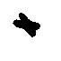
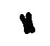
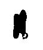
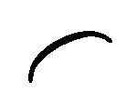
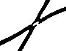
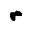
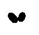
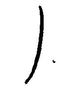
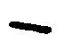

# Create a training dataset

## Steps:
1. Create a folder that will contain the three following folders: train, val and test
2. Inside of each folder (train, val and test) create the two following folders: longitudinal_division and other_division
3. Inside of longitudinal_division folder place black and white bacteria images (jpg or png) with logitudinal division. 
 
4. Inside of other_division folder place black and white bacteria images (jpg or png) with other type of division. 
 

The structure of the folder should be like this: 

<table>
  <thead>
    <tr>
      <th colspan=4>train</th>
      <th colspan=4>val</th>
      <th colspan=4>test</th>
    </tr>
  </thead>
  <tbody>
    <tr>
      <td colspan=2>longitudinal_division</td>
      <td colspan=2>other_division</td>
      <td colspan=2>longitudinal_division</td>
      <td colspan=2>other_division</td>
      <td colspan=2>longitudinal_division</td>
      <td colspan=2>other_division</td>
    </tr>
      <td></img> </img> </img>
      <td>  </td>
      <td>  </td>
    <tr>
    </tr>
  </tbody>
</table>
